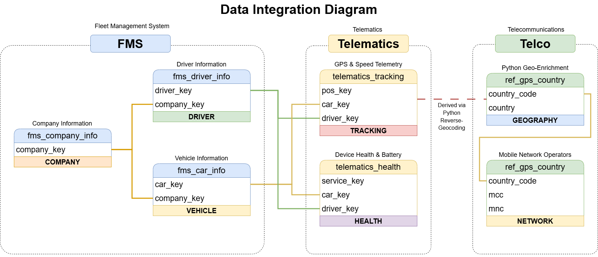
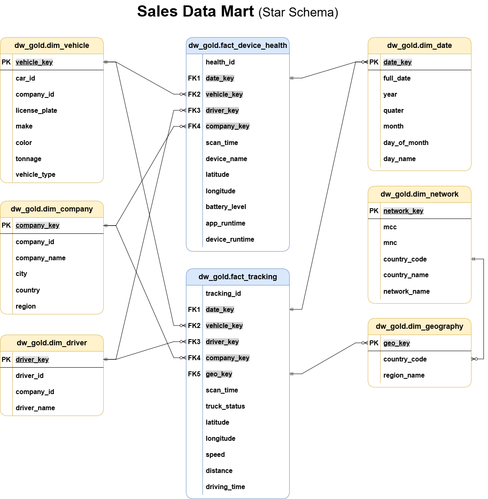

# 🚛 Fleet Telematics Data Warehouse Project

Welcome to the **Fleet Telematics Data Warehouse** repository! 🚀  
This project demonstrates an end-to-end data engineering solution designed to process high-frequency IoT tracking data and fleet master records. Using a standard **Medallion Architecture** (Bronze, Silver, Gold), we transform raw, messy telemetry and asset data into actionable, business-ready logistics insights.

---

## 🌟 Key Engineering Achievements
* **Advanced IoT Data Cleaning:** Engineered self-healing SQL logic to correct physical impossibilities in sensor data, such as calculating true speed using distance/time ($v=d/t$) to resolve GPS "multipath" drift and sensor spikes.
* **Geospatial Python Enrichment:** Built a Python bridge using reverse-geocoding to translate raw latitude/longitude coordinates into regional administrative boundaries (e.g., "Bavaria", "Central Bohemia") for spatial analysis.
* **Complex CDC Implementation:** Handled "Upsert" logic (`ON DUPLICATE KEY UPDATE`) to merge massive base snapshot tables with incremental update (`_upd`) files, ensuring a true Single Source of Truth.
* **Kimball Star Schema Design:** Modeled a robust reporting layer utilizing Surrogate Keys (`_key`), outrigger dimensions for Many-to-Many Telco relationships, and a dynamically generated "Smart Date" dimension via Recursive CTEs.

---

## 🏗️ Data Architecture

  
*(Above: High-level data flow and integration map across functional domains)*

The pipeline follows the standard **Medallion Architecture** to ensure data reliability and traceability:

1. **Bronze Layer**: Stores raw, immutable snapshots from source systems. We ingest both "Base" snapshots and "Update" (`_upd`) files to capture the latest state of the fleet.
2. **Silver Layer**: Merges base tables with updates to create a **Single Source of Truth**. This layer handles deduplication, unit-of-measure conversions (kg to tons), and anomaly detection.
3. **Gold Layer**: Houses business-ready data modeled into a **Star Schema** (Facts and Dimensions) optimized for fleet utilization, fuel efficiency, and driver performance reporting.

### 🌟 Gold Layer Data Model (Star Schema)

  
*(Above: Kimball Star Schema representing the final analytical Data Mart, optimized for BI reporting)*

👉 **[View the complete Data Catalog and Data Dictionary here](docs/data_catalog.md)**

---

## 📖 Functional Domains

This project models and integrates data from three completely distinct domains:

* **Source FMS (Fleet Management System)**: Master data for vehicles (`car_info`), drivers, and companies. This is the "What" and "Who".
* **Source Telematics (IoT)**: High-frequency transactional data (`import_tracking`, `import_health`) coming from GPS hardware. This is the "How" and "Where".
* **Source Telco**: Connectivity metadata (`operator_info`) providing geographical and network context via MCC/MNC codes. This is the "Context".

---

## 🛠️ Tools & Tech Stack

- **SQL (MySQL):** Core engine for Bronze/Silver/Gold transformations, CDC lookups, and Analytical Views.
- **Python:** For reverse-geocoding coordinates and data enrichment.
- **PHPMyAdmin / DBeaver:** For database management and query profiling.
- **Draw.io:** For designing the entity-relationship data models.
- **Git:** Version control for all DDL, ETL, and testing scripts.

---

## 🚀 Project Objectives

### 1. Building the Data Warehouse (Data Engineering)
- **Data Integration**: Resolve the "Split Table" challenge by merging base records with incremental update files.
- **Data Quality Framework**: Implement Window Functions (`LAG`) to detect hardware anomalies like impossible GPS teleportation and rapid battery discharge.
- **System Separation**: Organize data into logical schemas and maintain strict Key/ID naming conventions.

### 2. Analytics & Reporting (Data Analysis)
Deliver SQL-based analytics to provide visibility into:
- **Fleet Utilization**: Identify underused vehicles based on distance and driving time.
- **Hardware Health**: Monitor device battery levels and app runtimes to prevent data gaps.
- **Geographical Insights**: Map network operator codes to countries for international fleet tracking.

---

## 📂 Repository Structure
```text
fleet-telematics-dw/
│
├── datasets/                           
│   ├── source_fms/                     # Asset data (cars, drivers, companies)
│   ├── source_telematics/              # IoT logs (tracking, health, and updates)
│   └── source_telco/                   # Connectivity metadata (operator_info)
│
├── docs/                               # Project documentation and architecture details
│   ├── data_integration.png            # Visual flow of the source system integration
│   ├── data_catalog.md                 # Data dictionary for Gold Layer Facts & Dimensions
│   └── data_flow.png                   # ERD for the Gold Layer Star Schema
│
├── scripts/                            
│   ├── bronze/                         # Initial load scripts for all CSV sources
│   ├── silver/                         # Merge logic (CDC), data cleaning, and Python enrichment
│   └── gold/                           # Final Analytical models and Dimension Lookups
│
├── tests/                              # Data Quality framework and integrity checks
│
├── README.md                           # Project overview and instruction
└── .gitignore